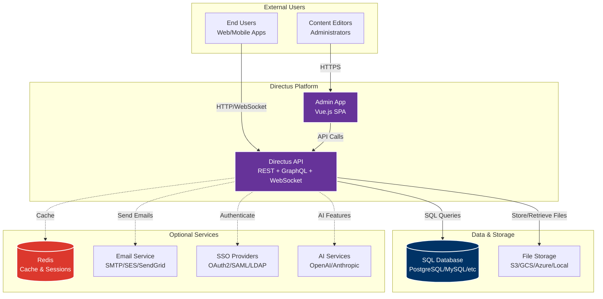
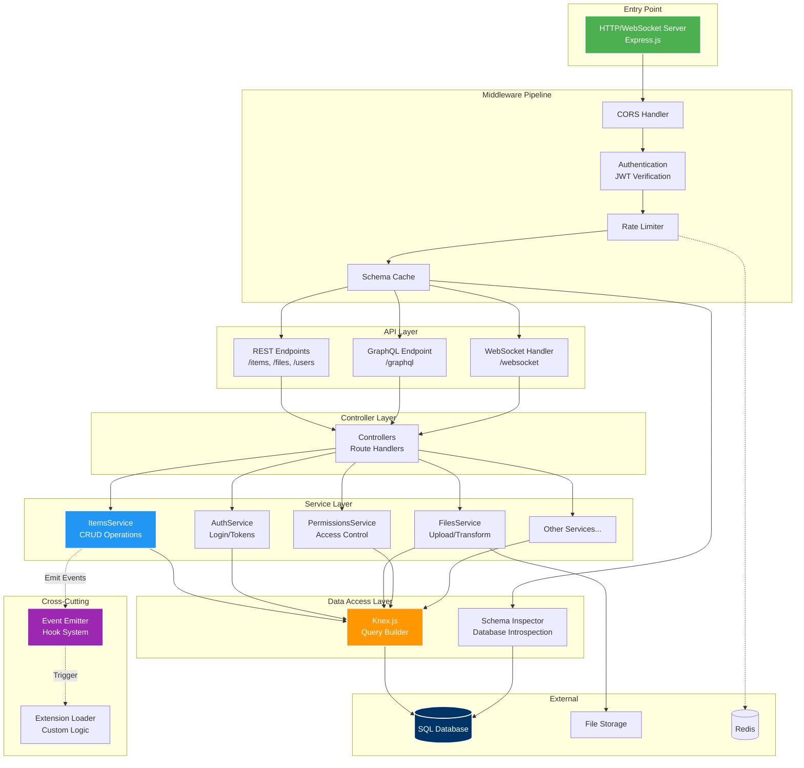
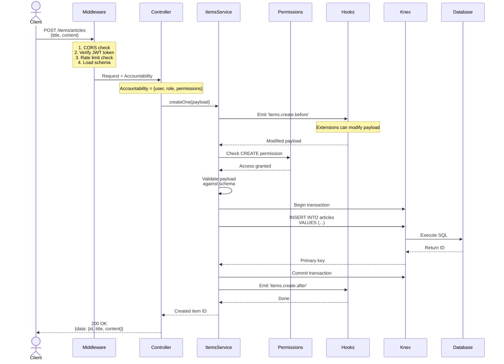

# System Architecture

## Overview

Directus is a **headless CMS** and **data platform** built on Node.js. It wraps your SQL database with a real-time REST
and GraphQL API, and provides an intuitive Admin App for managing content. The system follows a **database-first**
approach—your database schema defines the API automatically.

**Key Characteristics**:

- **Database-agnostic**: Supports PostgreSQL, MySQL, SQLite, MSSQL, CockroachDB, Oracle
- **Real-time**: WebSocket support for live queries and subscriptions
- **Extensible**: Hook system and custom extensions
- **Multi-tenant ready**: Role-based access control (RBAC) with granular permissions
- **API-first**: REST, GraphQL, and WebSocket APIs

---

## System Context Diagram

This diagram shows Directus from an external perspective—how it fits into your ecosystem.



**Key Points**:

- **Directus API** is the core—it serves both end users and the Admin App
- **Admin App** is a client of the API (no special backend access)
- **Database** is the source of truth for schema and data
- **Optional services** enhance functionality but aren't required

---

## Internal API Architecture

This diagram shows the internal structure of the Directus API—the layers and components.



**Architecture Layers** (top to bottom):

1. **Entry Point**: Express.js HTTP server handles all incoming requests
2. **Middleware Pipeline**: Sequential processing (CORS → Auth → Rate Limit → Schema)
3. **API Layer**: Three API styles (REST, GraphQL, WebSocket) all use the same backend
4. **Controller Layer**: Route handlers that validate input and call services
5. **Service Layer**: Business logic (ItemsService, AuthService, etc.)
6. **Data Access Layer**: Knex.js abstracts database operations
7. **Cross-Cutting**: Hooks and Extensions run at various points in the request lifecycle

**Key Architectural Constraints**:

- **Schema-driven**: Database schema is introspected at runtime and cached
- **Permission injection**: Permissions are injected as SQL filters (not post-query filtering)
- **Service-oriented**: All business logic lives in service classes
- **Event-driven**: Hook system allows extensions to intercept operations

---

## Request Lifecycle Sequence

This diagram shows what happens when a client creates an item (e.g., a blog article).



**Request Flow Steps**:

1. **Middleware Processing**: CORS, authentication, rate limiting, schema loading
2. **Accountability Extraction**: User, role, and permissions attached to request
3. **Controller Routing**: Request routed to appropriate controller
4. **Service Invocation**: Controller calls ItemsService.createOne()
5. **Before Hooks**: Extensions can modify or validate the payload
6. **Permission Check**: Verify user has CREATE permission on the collection
7. **Schema Validation**: Ensure payload matches database schema
8. **Database Transaction**: Insert data within a transaction
9. **After Hooks**: Extensions can perform post-creation actions
10. **Response**: Return created item to client

**Error Handling**: Any error triggers transaction rollback and returns appropriate HTTP status (400, 403, 500, etc.)

---

## Major Components

### API Package (`@directus/api`)

The backend Node.js application that provides the API.

**Key Directories**:

- `src/controllers/`: HTTP route handlers (items, files, users, auth, etc.)
- `src/services/`: Business logic layer (ItemsService, AuthService, FilesService, etc.)
- `src/middleware/`: Request processing pipeline (authentication, rate limiting, etc.)
- `src/database/`: Database connection, query building, schema introspection
- `src/permissions/`: Permission validation and filter injection
- `src/auth/`: Authentication drivers (local, OAuth2, LDAP, SAML)
- `src/websocket/`: WebSocket server for real-time features
- `src/extensions/`: Extension loading and management

**Core Services**:

- **ItemsService**: Generic CRUD operations for any collection
- **AuthService**: Login, token generation, password management
- **FilesService**: File upload, storage, and image transformation
- **PermissionsService**: Access control validation
- **UsersService**: User management (extends ItemsService)
- **CollectionsService**: Collection metadata management
- **FieldsService**: Field schema management

### Admin App (`@directus/app`)

Vue.js single-page application for content management.

**Key Directories**:

- `src/views/`: Main application views (login, content, settings)
- `src/modules/`: Feature modules (collections, files, users, insights)
- `src/components/`: Reusable UI components
- `src/composables/`: Vue composition functions
- `src/stores/`: Pinia state management stores

**State Management**:

- User authentication state
- Collection schemas
- Current user permissions
- UI preferences

### Shared Packages

**Core Packages**:

- `@directus/env`: Environment variable handling with defaults
- `@directus/schema`: Database schema introspection
- `@directus/types`: TypeScript type definitions
- `@directus/errors`: Standardized error classes
- `@directus/utils`: Shared utility functions
- `@directus/constants`: Shared constants
- `@directus/validation`: Validation utilities
- `@directus/system-data`: System collection definitions

**Storage Drivers**:

- `@directus/storage`: Storage abstraction layer
- `@directus/storage-driver-local`: Local filesystem
- `@directus/storage-driver-s3`: AWS S3
- `@directus/storage-driver-gcs`: Google Cloud Storage
- `@directus/storage-driver-azure`: Azure Blob Storage
- `@directus/storage-driver-cloudinary`: Cloudinary
- `@directus/storage-driver-supabase`: Supabase Storage

---

## Authentication & Authorization

### Authentication Flow

1. **Login**: User submits credentials to `/auth/login`
2. **Verification**: AuthService verifies password using argon2
3. **Token Generation**: JWT access token (15min default) and refresh token (7d default) are issued
4. **Token Storage**: Refresh token stored in database, access token sent to client
5. **Subsequent Requests**: Client includes access token in `Authorization: Bearer <token>` header
6. **Token Verification**: Middleware verifies JWT signature and extracts user/role
7. **Refresh**: Client uses refresh token to get new access token before expiry

**Supported Authentication Methods**:

- **Local**: Email/password with argon2 hashing
- **OAuth2**: Google, GitHub, Facebook, etc.
- **OpenID Connect**: Azure AD, Okta, etc.
- **LDAP**: Active Directory integration
- **SAML**: Enterprise SSO
- **SSO**: Custom SSO providers

### Authorization (RBAC)

**Permission Model**:

- **Roles**: Users belong to one role
- **Permissions**: Rules attached to roles defining access to collections
- **Actions**: `create`, `read`, `update`, `delete`
- **Fields**: Specify which fields are accessible
- **Filters**: Dynamic filters limit which items are accessible

**Permission Enforcement**:

1. User makes request with JWT token
2. Middleware extracts user and role from token
3. PermissionsService loads permissions for the role
4. Permissions are injected as SQL WHERE clauses (not post-query filtering)
5. Query executes with permission filters applied
6. Only accessible data is returned

**Example Permission**:

```json
{
	"role": "editor",
	"collection": "articles",
	"action": "update",
	"permissions": {
		"author": { "_eq": "$CURRENT_USER" }
	},
	"fields": ["title", "content", "status"]
}
```

This allows editors to update only their own articles, and only specific fields.

---

## Data Flow Patterns

### Schema Loading

1. **Startup**: Database schema is introspected using SchemaInspector
2. **Caching**: Schema is cached in memory (or Redis if configured)
3. **Requests**: Each request uses cached schema for validation
4. **Invalidation**: Schema cache is invalidated on collection/field changes
5. **Refresh**: Next request triggers schema re-introspection

### File Upload Flow

1. **Client**: Uploads file via `POST /files` (multipart/form-data)
2. **Middleware**: Busboy parses multipart data
3. **FilesService**:
   - Validates file type against whitelist
   - Generates unique filename
   - Stores file in configured storage (local/S3/GCS/etc.)
   - Extracts metadata (dimensions, EXIF, etc.)
   - Creates record in `directus_files` table
4. **Response**: Returns file metadata with ID
5. **Retrieval**: Files accessed via `/assets/:id` with optional transformations

### Image Transformation

- **On-demand**: Images transformed when requested via `/assets/:id?width=400&height=300`
- **Caching**: Transformed images cached to avoid re-processing
- **Sharp**: Uses Sharp library for high-performance image processing
- **Formats**: Supports JPEG, PNG, WebP, AVIF, TIFF

### Real-time Updates (WebSocket)

1. **Client**: Connects to `/websocket`
2. **Authentication**: Client sends JWT token
3. **Subscription**: Client subscribes to collections or specific items
4. **Events**: When data changes, server emits events to subscribed clients
5. **Filtering**: Subscriptions respect user permissions

---

## Extension System

### Hook System

Extensions can register hooks to intercept operations:

**Hook Types**:

- **Filter Hooks**: Modify data before/after operations (`items.create.before`, `items.update.after`)
- **Action Hooks**: Perform side effects (`files.upload`, `auth.login`)
- **Init Hooks**: Run on server startup
- **Schedule Hooks**: Cron-based scheduled tasks

**Example Hook**:

```javascript
export default ({ filter }) => {
	filter('items.create.before', async (input, { collection }) => {
		if (collection === 'articles') {
			input.slug = slugify(input.title);
		}
		return input;
	});
};
```

### Extension Types

- **Endpoints**: Custom API endpoints
- **Hooks**: Event listeners
- **Interfaces**: Custom field interfaces (Admin App)
- **Displays**: Custom field displays (Admin App)
- **Layouts**: Custom collection layouts (Admin App)
- **Modules**: Custom Admin App pages
- **Panels**: Dashboard widgets
- **Operations**: Custom flow operations

---

## Key Design Patterns

### 1. Service Layer Pattern

All business logic is encapsulated in service classes. Controllers are thin and only handle HTTP concerns.

**Benefits**:

- Testable business logic
- Reusable across different API styles (REST, GraphQL, WebSocket)
- Clear separation of concerns

### 2. Repository Pattern

Knex.js acts as a repository abstraction over the database.

**Benefits**:

- Database-agnostic queries
- Transaction management
- Query building and composition

### 3. Event-Driven Architecture

Hook system allows decoupled extensions.

**Benefits**:

- Extensibility without modifying core
- Loose coupling
- Side effects isolated from main logic

### 4. Middleware Pipeline

Express middleware processes requests sequentially.

**Benefits**:

- Clear request processing flow
- Composable middleware
- Easy to add cross-cutting concerns

### 5. Schema-First Design

Database schema drives API behavior.

**Benefits**:

- No code generation needed
- API automatically reflects database changes
- Single source of truth (database)

---

## Performance Considerations

### Caching Strategy

- **Schema Cache**: Database schema cached in memory/Redis
- **Permission Cache**: User permissions cached per request
- **Response Cache**: Optional HTTP response caching
- **Asset Cache**: Transformed images cached

### Database Optimization

- **Connection Pooling**: Knex manages connection pool
- **Query Optimization**: Permissions injected as SQL filters (not post-filtering)
- **Indexes**: Relies on database indexes for performance
- **Transactions**: Used for data consistency

### Scalability

- **Horizontal Scaling**: Requires Redis for shared cache/sessions
- **Stateless**: API is stateless (JWT-based auth)
- **Load Balancing**: Can run multiple instances behind load balancer
- **Database**: Database is the bottleneck—use managed database services

---

## Deployment Architecture

### Recommended Production Setup

```
[Load Balancer]
      |
      v
[Directus API Instances (N)]
      |
      +---> [PostgreSQL (Primary + Replicas)]
      +---> [Redis (Cache + Sessions)]
      +---> [S3-compatible Storage]
      +---> [Email Service (SES/SendGrid)]
```

**Requirements**:

- **Database**: Managed PostgreSQL with read replicas
- **Redis**: For cache and session storage
- **Object Storage**: S3/GCS/Azure for files
- **Load Balancer**: For multiple API instances
- **CDN**: For asset delivery

---

## Security Architecture

### Defense in Depth

1. **Network**: HTTPS only, CORS configuration
2. **Authentication**: JWT with short expiry, refresh token rotation
3. **Authorization**: RBAC with granular permissions
4. **Input Validation**: Joi/Zod schema validation
5. **SQL Injection**: Parameterized queries via Knex
6. **XSS**: Content Security Policy headers
7. **Rate Limiting**: Configurable rate limits per endpoint
8. **File Upload**: MIME type validation, size limits

### Secrets Management

- **Environment Variables**: All secrets via env vars
- **No Hardcoding**: No secrets in code or config files
- **Rotation**: Support for key rotation (JWT secrets, database passwords)

---

## Monitoring & Observability

### Logging

- **Pino**: High-performance JSON logging
- **Structured Logs**: All logs in JSON format
- **Log Levels**: DEBUG, INFO, WARN, ERROR
- **Request Logging**: All HTTP requests logged with timing

### Metrics (Optional)

- **Prometheus**: Metrics endpoint (`/metrics`) if enabled
- **Custom Metrics**: Request counts, response times, error rates
- **Database Metrics**: Query counts, connection pool stats

### Health Checks

- **Ping**: `/server/ping` returns "pong"
- **Health**: `/server/health` checks database, cache, storage
- **Info**: `/server/info` returns version and project info

---

## Assumptions and Constraints

### Assumptions

1. **SQL Database**: System assumes a SQL database (not NoSQL)
2. **Schema Control**: Users have full control over database schema
3. **Single Database**: One Directus instance per database
4. **Node.js Runtime**: Requires Node.js v22+
5. **Modern Browsers**: Admin App requires modern browser (ES2020+)

### Constraints

1. **Database Schema**: Must be introspectable via SQL
2. **Primary Keys**: All tables must have a primary key
3. **Reserved Names**: System collections prefixed with `directus_`
4. **File Size**: Upload size limited by `MAX_PAYLOAD_SIZE` env var
5. **Query Depth**: Relational queries limited by `MAX_RELATIONAL_DEPTH`
6. **Batch Operations**: Limited by `MAX_BATCH_MUTATION` env var

### Known Limitations

1. **NoSQL**: No support for MongoDB, DynamoDB, etc.
2. **Multi-tenancy**: Single database per instance (no built-in multi-tenancy)
3. **Offline**: Admin App requires internet connection
4. **Real-time**: WebSocket subscriptions require sticky sessions in load-balanced setups
5. **Migrations**: No automatic migration rollback support
